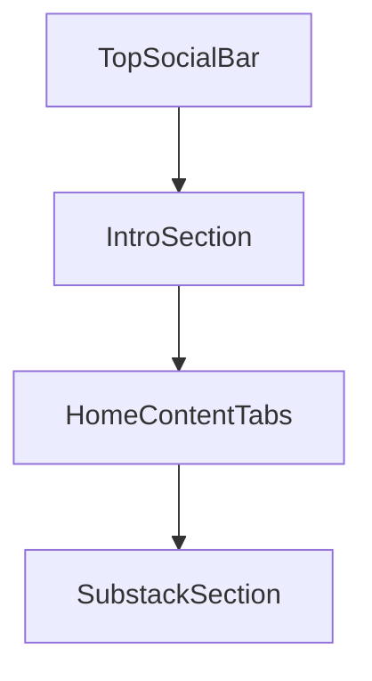

# 首页落地页改造计划（Alyssa 式分区 + Tab 内容）

## 现状与目标

- **现状**：首页由 [`HeroSection`](src/components/hero-section.tsx) + 三个独立 `section`（精选产品、最新文章、播客）+ [`NewsletterCTA`](src/components/newsletter-cta.tsx) 组成；社媒 [`socialLinks`](src/globals/SiteSettings.ts) 仅在 [`SiteFooter`](src/components/site-footer.tsx) 展示。
- **目标**：按你列出的 5 段顺序组织首屏内容；**不复制**参考站的可视资产与文案，只借鉴常见的作品集式信息架构（顶栏社媒、简介区、Tab 切换列表、通讯订阅条、页脚）。
- **数据**：你已选择 **Payload 新集合** 维护「作品」与「视频」。

## 信息架构（页面内顺序）

全局 [`SiteLayout`](src/app/\\\\(site)/layout.tsx) 仍保留现有 `SiteHeader` + `SiteFooter`；**仅替换 `children` 中首页主体**为：

页脚仍为布局里的 `SiteFooter`（第 5 点「底部 footer」）。

## 1. 顶部社媒入口

- 新增小组件（如 `home-top-social.tsx`）：从全局 `site-settings.socialLinks` 读取，在首页**主内容最上方**渲染一排外链（图标 + 可访问名称）；与 footer 社媒复用同一数据源，避免重复维护。
- 图标：用 `lucide-react` 做有限映射（如 GitHub / X / YouTube 等），未知平台用 `Link` 或 `Globe` 兜底。

## 2. 个人介绍区块

- 在 [`SiteSettings`](src/globals/SiteSettings.ts) 增加可选字段（命名示例）：`introHeadline`（一句话标题）、`introBody`（textarea 或 richText，二选一以控制复杂度）、`introAvatar`（upload → `media`）、可选 `introLinks`（与主站导航重复的 CTA 可省略，避免信息过载）。
- 将现有 `heroTitle` / `heroSubtitle` **迁移语义**：新首页以 `introHeadline` + `introBody` 为主；若为空则 **fallback** 到现有 `heroTitle` / `heroSubtitle`，避免已有站点内容空白。
- 新建 `home-intro.tsx`（或重构 `hero-section.tsx`）：偏「作品集首屏」排版（头像 + 标题 + 正文），弱化当前双栏里右侧固定说明卡片，使视觉更接近参考站的**单栏叙事**（具体间距/字号按现有 Tailwind 与 `globals.css` token 统一）。

## 3. Tab：博客 / 产品 / 作品 / 播客 / 视频

- 新增 **客户端** 组件 `home-content-tabs.tsx`（`"use client"`）：用项目已有 [`@base-ui/react`](package.json) 或轻量自研 Tab（按钮组 + `aria`），切换时只更换下方列表区域，避免整页刷新。
- **服务端** [`page.tsx`](src/app/\\\\(site)/page.tsx) 用 `Promise.all` 并行请求：`posts`、`products`、`podcasts`（沿用现有查询条件）、**新增** `works`、`videos`。
- 各 Tab 内复用现有卡片模式：
  - 博客 → [`PostCard`](src/components/post-card.tsx)
  - 产品 → [`ProductCard`](src/components/product-card.tsx)
  - 播客 → [`PodcastCard`](src/components/podcast-card.tsx)
  - 作品 / 视频 → 新建 `WorkCard`、`VideoCard`（缩略图、标题、摘要或平台标签；视频卡片主按钮打开 YouTube/Bilibili 外链）。
- 列表数量：首页建议每类 `limit` 与现网类似（如 6～12），并提供「查看全部」链到 `/blog`、`/products`、`/podcast` 等；**作品**、**视频**在新增列表页后链到 `/works`、`/videos`（见下）。

### Payload：新集合

- **`works`**（[`src/collections/Works.ts`](src/collections/Works.ts) 新建）：`title`、`slug`、`summary`、`coverImage`、`status`（draft/published）、`publishedAt`、`featured`（可选）、`externalUrl`（可选）、`content`（richText，可选，用于详情页）。
- **`videos`**（[`src/collections/Videos.ts`](src/collections/Videos.ts) 新建）：`title`、`platform`（`youtube` | `bilibili`）、`videoUrl`（必填）、`thumbnail`（upload，可选）、`description`（可选）、`publishedAt`、`status`。
- 在 [`payload.config.ts`](src/payload.config.ts) 注册两集合；本地/部署后执行 `pnpm generate:types` 更新 [`payload-types.ts`](src/payload-types.ts)。

### 路由（与 Tab 一致、利于 SEO）

- 新增 [`src/app/(site)/works/page.tsx`](src/app/\\\\(site)/works/page.tsx) 与 [`src/app/(site)/works/[slug]/page.tsx`](src/app/(site)/works/[slug]/page.tsx)（结构对齐 [`products`](src/app/\\\\(site)/products/page.tsx)）。
- 新增 [`src/app/(site)/videos/page.tsx`](src/app/\\\\(site)/videos/page.tsx)（网格列表；详情页可选，因多数视频以外链为主，**MVP 可只做列表页 + 外链**）。

## 4. Substack 入口

- 复用 `newsletterUrl` / `newsletterTitle` / `newsletterDescription`，将 [`NewsletterCTA`](src/components/newsletter-cta.tsx) 作为独立区块放在 Tab 区块**之后**；文案上可在组件内将按钮改为可配置（例如在 Site Settings 增加 `newsletterButtonLabel`，默认 `Subscribe`），便于写明「在 Substack 订阅」。

## 5. Footer

- [`SiteFooter`](src/components/site-footer.tsx) 保持不动或仅做微调（例如副标题若写死英文，可改为读取 `siteDescription`），避免重复大改。

## 其他配套

- **[`scripts/seed.ts`](scripts/seed.ts)**：可选各插入 1 条示例 `work`、`video`，便于本地预览 Tab 不为空。
- **主导航**：可在 [`defaultMainNav`](src/lib/nav.ts) 与 seed 的 `mainNav` 中增加「作品」「视频」链到 `/works`、`/videos`（若你希望全站可发现；否则仅首页 Tab 也可）。

## 风险与注意

- **数据库迁移**：新增集合会改变 Postgres schema，部署前需在目标环境跑迁移/启动 Payload。
- **参考站**：仅借鉴分区与 Tab 交互；视觉以你站现有设计 token 为准，避免像素级拷贝。